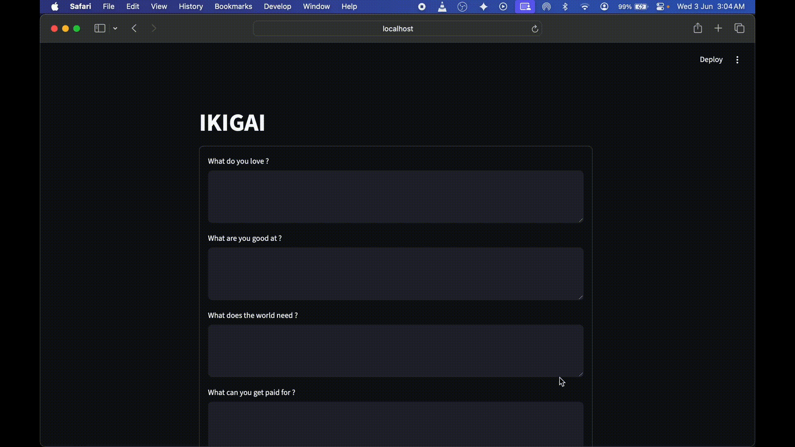

# Find My IKIGAI

- Built a small Streamlit app - IKIGAI as a quick experiment with LLMs with langchain and langsmith.
- It takes 4 simple inputs, sends them to an LLM, and displays the response. Nothing complex, just a minimal setup to understand LLM flow.

## Demo


## Workflow

1. User fills a form with 4 answers (love, good at, world needs, paid for)
2. On submit, answers get merged into one prompt
3. Prompt runs through a LangChain chain
4. Result is rendered on the page

## The chain

```python
chain = promptTemplate | llm | OutputParser
```

- `promptTemplate` — system persona + user query, both swappable
- `llm` — Gemini model
- `OutputParser` — returns plain text instead of a message object

`get_llm_chain(system_text)` builds this chain, so persona/behavior can change (e.g. "be very concise") without touching the prompt structure. `index.py` just calls `chain.invoke({"query": ...})` — it never deals with prompts or models directly.

## Files

- `index.py` — UI, form, prompt building, rendering
- `llm.py` — chain factory + standalone test (`python llm.py`)

## Setup

```bash
pip install streamlit langchain-core langchain-google-genai python-dotenv
```

`.env`:
```
GOOGLE_API_KEY=your_key_here
```

## Run

```bash
streamlit run index.py
```

## Tech Stack

- Streamlit
- LangChain
- Google Gemini (via langchain-google-genai)


